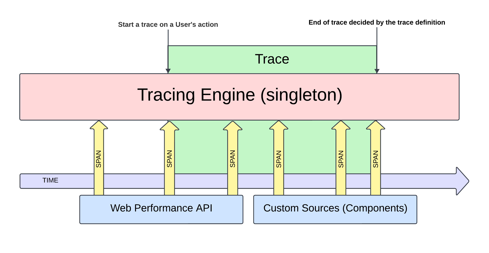

### Model Overview

The primary way to capture metrics would be to record a **Product Operation trace**. Such a **trace** would include the **spans** that occurred while the application was changing state, e.g. after a user performed a specific operation. The associated trace recording would then contain browser **spans**, like network requests, or other PerformanceEntries, as well as custom **spans**, like component renders.

The Frontend Tracing model works as follows:

1. The **Tracing Engine** is a singleton instantiated when the application boots. It provides the public API for initiating a new Trace using one of the **Trace Definitions**.
2. **Trace Definition files** are created once a decision to instrument observability of a given **Product Operation** is made. The definitions include the `name` of the operation, along with the criteria by which **spans** required to consider the **Product Operation** `complete` are matched, as well as other optional details (such as: criteria by which an operation may be interrupted or how long it can be active before timing-out).
3. A **Trace** is started imperatively, in response to a user’s action (such as _clicking_ or _pressing a key_), or a remote event (e.g. _receiving a message, or a new notification_).
   Only a single **Product Operation Trace** can be active at a time.
4. **Tracing Engine** listens for new **spans**, which are processed against the **active Trace’s Definition**, and stored in a list.
5. The **Trace** is considered _complete_ once all of the _required_ **spans** have been seen, or
6. The **Trace** is considered _interrupted,_ if any of the following occurs:
   1. an _interrupting_ **spans** has been seen (as per trace definition)
   2. the **Trace** is manually interrupted
   3. the **Trace** times-out
   4. another **Trace** starts
7. The **Tracing Engine** generates a serializable **Trace Recording** containing all the seen **spans**. The resulting JSON output can be:
   1. sent to an observability service for analysis (we plan on using Datadog RUM)
   2. used to calculate individual metrics from the trace (e.g. for long-term analysis these might be stored in Datadog Metrics)
   3. downloaded as a file and visualized (when debugging a problem locally)

### Deriving SLIs and other metrics from a trace

ℹ️ It is our recommendation that the primary way of creating duration metrics would be to derive them from data in the trace.

Instead of the traditional approach of capturing isolated metrics imperatively in the code, the **trace** model allows us the flexibility to define and compute any number of metrics from the **trace recording**.

We can distinguish the following types of metrics:

1. **Duration of a Computed Span** — the time between any two **spans** that appeared in the **trace**. For example:
   1. _time between the user’s click on a ticket_ and _everything in the ticket page has fully rendered with content_ (duration of the entire operation)
   2. _time between the user’s click on a ticket_ and _the moment the first piece of the ticket UI was displayed_ (duration of a segment of the operation)

2. **Computed Values** — any numerical value derived from the **spans** or their attributes. For example:
   1. _The total number of times the OmniLog re-renders during a ticket load_
   2. _The total number of requests to agent-graph made while loading the ticket_
   3. _The total number of ZAF apps initialized while loading the ticket_

### Measuring _Visually Complete_ in React

Knowing whether a component is visually complete can be a challenge due to React’s renderer design, as it is impossible to deterministically tell how many times a given component will re-render in a given state. In order to ensure the Trace is as complete as possible, the **Trace Definition** may define a list of **spans** that will trigger a debouncing period, during which we may allow for these **spans** to “settle”.

### _Visually Complete_ vs _Fully Interactive_

Due to the single-threaded, event-loop-based nature of JavaScript, both asynchronous work, and DOM painting scheduled during a **Product Operation** may continue even after all the end criteria have been satisfied.
While the end of a **Product Operation** gives us an indication of when the operation is _visually complete_, the user might still be blocked from interacting with the page. Thus, the duration of a **Trace** may not fully reflect the user’s _actual_ experience on the page.

The **Trace Definition** may be configured to continue recording additional **spans**, until the page becomes fully interactive. The _fully-interactive_ time is determined by a configurable _quiet period_, in which no significant “[long-task](https://developer.mozilla.org/en-US/docs/Glossary/Long_task)” or “[long-animation-frame](https://developer.mozilla.org/en-US/docs/Web/API/Performance_API/Long_animation_frame_timing)” **spans** have been seen.

These additional **spans** won’t contribute to the reported duration of the Trace, but may be used to create computed **spans** (e.g. Time To Interactive — TTI).
